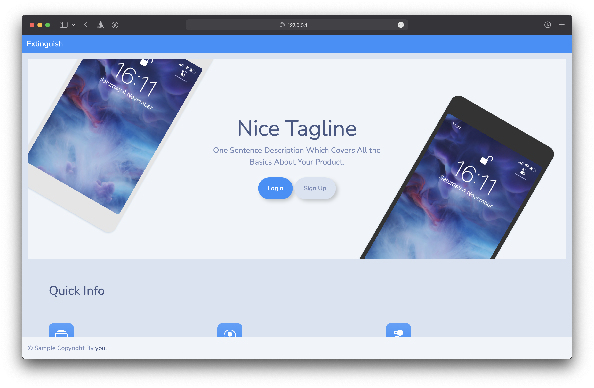
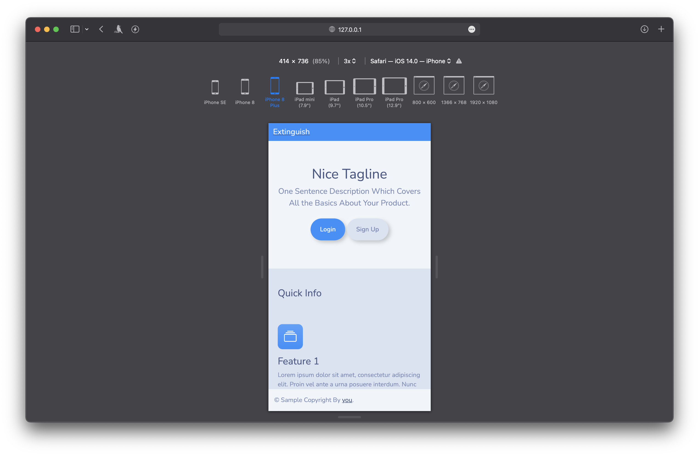
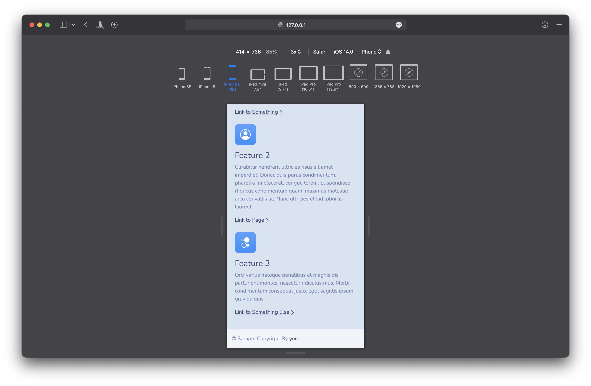
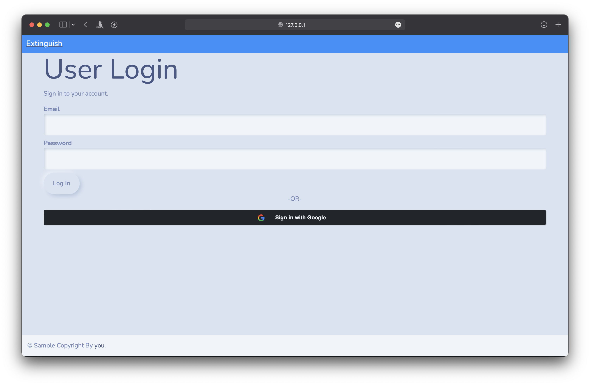
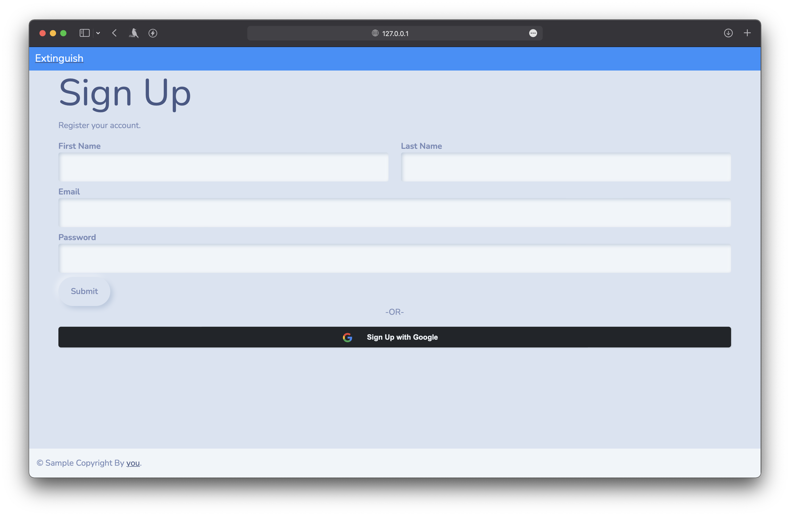
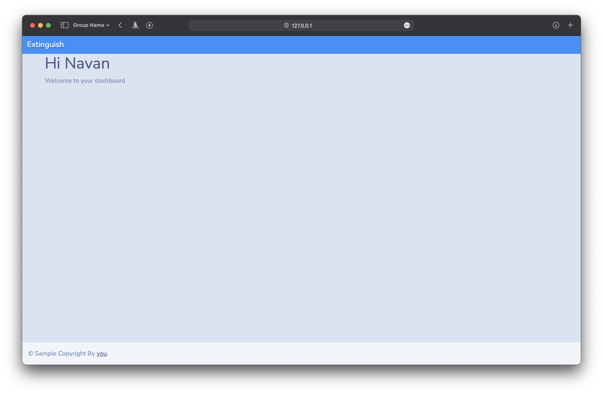
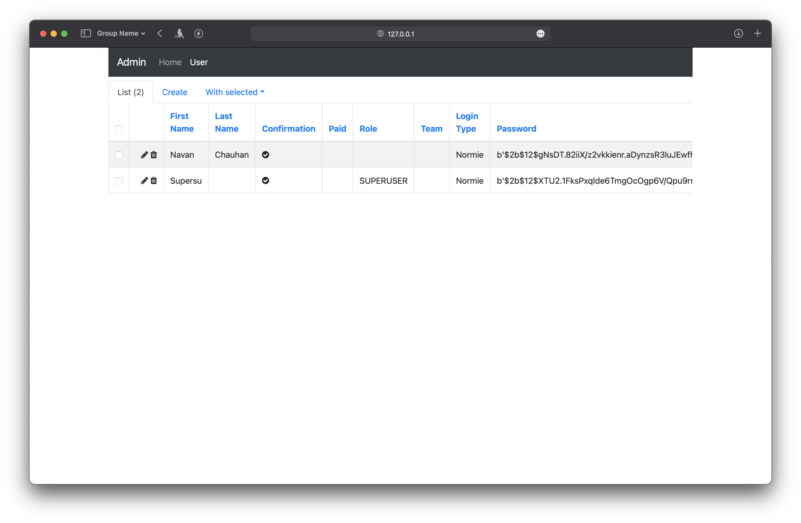

# SaaS-in-a-Flask

[](https://codecov.io/gh/navanchauhan/SaaS-in-a-Flask)
[](https://github.com/navanchauhan/SaaS-in-a-Flask/actions/workflows/Flask-Tests.yaml)
[](https://deepsource.io/gh/navanchauhan/SaaS-in-a-Flask/?ref=repository-badge)

In the wise words of @alectrocute:

> I've noticed SaaS bootstraps/boilerplates being sold upwards of $1,000 per year and I think that's fucking ridiculous.

## Features / To-Do

- [x] **Landing Page:** Written in Bootstrap 5, compatible with [Bootswatch Themes](https://bootswatch.com) (Just replace bootstrap.min.css)
- [x] **Database Management:** Using CLI or Superuser view
	- [x] **Migration:** Using Flask-Migrate
- **Authentication:** Using Flask-Login 
	- [x] Sign Up
	- [x] Sign In
	- [x] **OAuth2:** Using Authlib
	- [ ] LDAP
	- [ ] Forgot Password
	- [x] Confirm Email
	- [x] **Password Hashing:** Using Bcrypt (Flask-Bcrypt)
- [x] **Form Handling:** With Flask-WTF using WTForms
- [x] Dashboard
- [x] GitHub Workflows
- [x] **Admin Pages:** Using Flask-Admin
- [ ] Role Support
- [ ] Team Management
- Error Handling
	- [x] Sentry Support
	- [x] Error Code Handling
- [ ] Async AJAX Calls 
- [x] **Tests:** Using PyTest
- [x] **Code Coverage:** Using CodeCov
- [ ] Delayed Jobs
- [ ] Logging
- [x] FastAPI Support
- Billing Handling
	- [ ] Stripe
- [ ] GDPR Compliance / Data Export
- [x] Docker Images
- [x] **Automatic Deployments:** Using Heroku [Sample Deployment](https://saas-in-a-flask.herokuapp.com)

## Screenshots

### Landing















## Quick How-Tos

### Installing Dependencies

You can either use the provided Pipfile using pipenv or use requirements.txt with pip

```
python3 -m venv venv
source venv/bin/activate
pip3 install pipenv
pipenv install --dev

```
```
python3 -m venv venv
source venv/bin/activate
pip3 install -r requirements.txt

```

### Initialise Database and add super-user

```
FLASK_APP=app flask database create
FLASK_APP=app flask database admin-create

```

### Generate SSL Certificate to test Sign in With Google

Even while developing on a local server. You still need to run your server as HTTPS to test Sign in With Google

```
make cert-create
make dev-ssl

```


### Configurations

The following environment variables should be set 

#### Sign in with Google

| Variable |
|----------|
|GOOGLE_CLIENT_ID|
|GOOGLE_CLIENT_SECRET|

#### E-Mail Confirmation

| Variable | Example |
|----------|---------|
|MAIL_USE_TLS|True|
|MAIL_PORT|587|
|MAIL_FROM|navan@pi4.navan.dev|
|MAIL_SERVER|pi4.navan.dev|
|MAIL_USERNAME|navan|
|MAIL_PASSWORD|fysdoifhsdfsd|

#### Sentry Error Reporting

| Variable |
|----------|
|SENTRY_DSN|

### Running Tests

You need to be in the base directory of the repo to run tests.

#### Using Pipenv

```
pipenv run tests
```

#### Manually

```
python -m pytest
```

#### GitHub Workflow

The GitHub Workflow automatically installs all dependencies in the requirements.txt file and runs pytest on different Python 3 versions (3.7, 3.8 ,3.9). To generate the requirements.txt file from pipenv use `pipenv lock --dev -r > requirements.txt`

### Code Coverage

[Codecov](https://codecov.io) is used to automatically generate reports and upload to their website using a GitHub Action. Make sure to set up `CODECOV_TOKEN` secret in your repo to use the workflow.